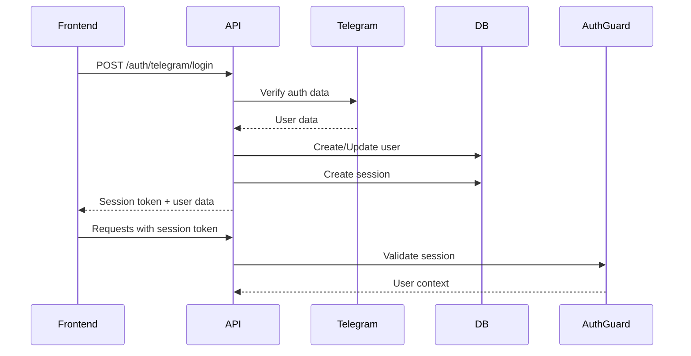

# 🏗️ Архитектура Lumon API

## Обзор

Lumon API построен на NestJS с использованием TypeScript, TypeORM и PostgreSQL.

---

## Структура проекта

```
back/api/
├── src/
│   ├── modules/           # Функциональные модули
│   │   ├── auth/         # Аутентификация
│   │   ├── users/        # Пользователи
│   │   ├── companies/    # Компании
│   │   ├── chats/        # Чаты
│   │   ├── messages/     # Сообщения
│   │   ├── ai/           # AI интеграция
│   │   ├── telegram/     # Telegram бот
│   │   ├── analytics/    # Аналитика
│   │   └── admin/        # Админ панель
│   │
│   ├── entities/         # TypeORM entities
│   │   ├── user.entity.ts
│   │   ├── company.entity.ts
│   │   ├── chat.entity.ts
│   │   └── ...
│   │
│   ├── common/           # Общие компоненты
│   │   ├── decorators/   # Кастомные декораторы
│   │   ├── guards/       # Auth guards
│   │   ├── interceptors/ # Interceptors
│   │   └── filters/      # Exception filters
│   │
│   ├── config/           # Конфигурация
│   │   ├── database.config.ts
│   │   └── app.config.ts
│   │
│   ├── app.module.ts     # Root module
│   └── main.ts           # Entry point
│
├── dist/                 # Compiled JavaScript
├── docs/                 # Документация
├── .env                  # Environment variables
├── package.json          # Dependencies
└── tsconfig.json         # TypeScript config
```

---

## Модули

### Auth Module

**Функции:**
- Аутентификация через Telegram
- Session management
- Role-based access control (RBAC)

**Endpoints:**
```
POST   /auth/telegram/login
POST   /auth/logout
GET    /auth/me
GET    /auth/session
```

**Guards:**
- `AuthGuard` - проверка авторизации
- `RolesGuard` - проверка ролей

### Users Module

**Функции:**
- Управление профилями
- Лимиты пользователей
- User-Company relations

**Endpoints:**
```
GET    /users/me
PATCH  /users/me
GET    /users/:id
GET    /users/:id/companies
POST   /users/:id/limits
```

### Chats Module

**Функции:**
- Создание чатов
- Управление сообщениями
- История переписки

**Endpoints:**
```
POST   /chats
GET    /chats/:id
DELETE /chats/:id
GET    /chats/:id/messages
POST   /chats/:id/messages
```

### AI Module

**Функции:**
- Интеграция с OpenAI
- Генерация ответов
- Контекст диалога

**Endpoints:**
```
POST   /ai/chat
POST   /ai/complete
GET    /ai/models
```

### Analytics Module

**Функции:**
- Сбор метрик
- A/B тестирование
- Platform stats

**Endpoints:**
```
GET    /analytics/stats
GET    /analytics/experiments
POST   /analytics/events
```

---

## Database Schema

### Core Tables

#### users
```sql
id              UUID PRIMARY KEY
telegram_id     BIGINT UNIQUE
username        VARCHAR
first_name      VARCHAR
last_name       VARCHAR
is_admin        BOOLEAN DEFAULT FALSE
created_at      TIMESTAMP
last_login_at   TIMESTAMP
```

#### companies
```sql
id          UUID PRIMARY KEY
name        VARCHAR NOT NULL
created_at  TIMESTAMP
is_active   BOOLEAN DEFAULT TRUE
```

#### user_companies
```sql
id          UUID PRIMARY KEY
user_id     UUID REFERENCES users
company_id  UUID REFERENCES companies
role        ENUM('owner', 'manager', 'viewer')
is_active   BOOLEAN DEFAULT TRUE
created_at  TIMESTAMP

UNIQUE(user_id, company_id)
```

#### sessions
```sql
id             UUID PRIMARY KEY
user_id        UUID REFERENCES users
session_token  VARCHAR UNIQUE
role           ENUM('owner', 'manager', 'viewer')
expires_at     TIMESTAMP
is_active      BOOLEAN
created_at     TIMESTAMP
last_used_at   TIMESTAMP
```

#### chats
```sql
id         UUID PRIMARY KEY
user_id    UUID REFERENCES users
title      VARCHAR
is_active  BOOLEAN DEFAULT TRUE
created_at TIMESTAMP
updated_at TIMESTAMP
```

#### messages
```sql
id         UUID PRIMARY KEY
chat_id    UUID REFERENCES chats
role       ENUM('user', 'assistant', 'system')
content    TEXT NOT NULL
created_at TIMESTAMP
```

### Analytics Tables

#### platform_stats
```sql
id                    UUID PRIMARY KEY
total_users           INT
total_chats           INT
total_messages        INT
active_users_24h      INT
active_users_7d       INT
messages_today        INT
avg_session_duration  FLOAT
recorded_at           TIMESTAMP
```

#### ab_experiments
```sql
id          UUID PRIMARY KEY
name        VARCHAR UNIQUE
variant_a   VARCHAR
variant_b   VARCHAR
is_active   BOOLEAN
created_at  TIMESTAMP
```

---

## Authentication Flow

### Telegram Login



### Session Management

1. **Login:** Создается новая сессия с токеном
2. **Requests:** Токен передается в заголовке `Authorization: Bearer <token>`
3. **Validation:** Guard проверяет токен в БД
4. **Expiry:** Сессия истекает через 7 дней
5. **Logout:** Сессия деактивируется

---

## Guards & Interceptors

### AuthGuard

```typescript
@Injectable()
export class AuthGuard implements CanActivate {
  canActivate(context: ExecutionContext): boolean {
    const request = context.switchToHttp().getRequest();
    const session = request.session;
    return session && session.is_active;
  }
}
```

### RolesGuard

```typescript
@Injectable()
export class RolesGuard implements CanActivate {
  canActivate(context: ExecutionContext): boolean {
    const requiredRoles = this.reflector.get<UserRole[]>('roles', context.getHandler());
    const { user } = context.switchToHttp().getRequest();
    return requiredRoles.some((role) => user.role === role);
  }
}
```

### Logging Interceptor

```typescript
@Injectable()
export class LoggingInterceptor implements NestInterceptor {
  intercept(context: ExecutionContext, next: CallHandler): Observable<any> {
    const now = Date.now();
    return next.handle().pipe(
      tap(() => console.log(`Request took ${Date.now() - now}ms`))
    );
  }
}
```

---

## Configuration

### Environment Variables

```typescript
// config/database.config.ts
export const databaseConfig = () => ({
  type: 'postgres',
  host: process.env.DB_HOST,
  port: parseInt(process.env.DB_PORT, 10),
  username: process.env.DB_USERNAME,
  password: process.env.DB_PASSWORD,
  database: process.env.DB_DATABASE,
  ssl: process.env.DB_SSL === 'true',
  entities: [__dirname + '/../**/*.entity{.ts,.js}'],
  synchronize: process.env.NODE_ENV !== 'production',
});
```

### App Configuration

```typescript
// main.ts
async function bootstrap() {
  const app = await NestFactory.create(AppModule);

  // CORS
  app.enableCors({
    origin: ['https://psayha.ru', 'https://n8n.psayha.ru'],
    credentials: true,
  });

  // Validation
  app.useGlobalPipes(new ValidationPipe({
    whitelist: true,
    forbidNonWhitelisted: true,
    transform: true,
  }));

  // Rate limiting
  app.use(rateLimit({
    windowMs: 60 * 1000,
    max: 100,
  }));

  await app.listen(3000);
}
```

---

## Error Handling

### Custom Exceptions

```typescript
export class BusinessException extends HttpException {
  constructor(message: string) {
    super({ message, code: 'BUSINESS_ERROR' }, HttpStatus.BAD_REQUEST);
  }
}
```

### Global Exception Filter

```typescript
@Catch()
export class AllExceptionsFilter implements ExceptionFilter {
  catch(exception: unknown, host: ArgumentsHost) {
    const ctx = host.switchToHttp();
    const response = ctx.getResponse();
    const request = ctx.getRequest();

    const status = exception instanceof HttpException
      ? exception.getStatus()
      : HttpStatus.INTERNAL_SERVER_ERROR;

    response.status(status).json({
      statusCode: status,
      timestamp: new Date().toISOString(),
      path: request.url,
      message: exception.message || 'Internal server error',
    });
  }
}
```

---

## Best Practices

### DTOs (Data Transfer Objects)

```typescript
export class CreateChatDto {
  @IsString()
  @IsNotEmpty()
  @MaxLength(100)
  title: string;

  @IsOptional()
  @IsString()
  initialMessage?: string;
}
```

### Service Layer

```typescript
@Injectable()
export class ChatsService {
  constructor(
    @InjectRepository(Chat)
    private chatsRepository: Repository<Chat>,
  ) {}

  async create(userId: string, dto: CreateChatDto): Promise<Chat> {
    const chat = this.chatsRepository.create({
      user_id: userId,
      title: dto.title,
    });
    return this.chatsRepository.save(chat);
  }
}
```

### Controller

```typescript
@Controller('chats')
@UseGuards(AuthGuard)
export class ChatsController {
  constructor(private readonly chatsService: ChatsService) {}

  @Post()
  @HttpCode(HttpStatus.CREATED)
  async create(
    @CurrentUser() user: User,
    @Body() dto: CreateChatDto,
  ): Promise<Chat> {
    return this.chatsService.create(user.id, dto);
  }
}
```

---

## Testing

### Unit Tests

```typescript
describe('ChatsService', () => {
  let service: ChatsService;
  let repository: Repository<Chat>;

  beforeEach(async () => {
    const module = await Test.createTestingModule({
      providers: [
        ChatsService,
        {
          provide: getRepositoryToken(Chat),
          useValue: mockRepository,
        },
      ],
    }).compile();

    service = module.get<ChatsService>(ChatsService);
    repository = module.get(getRepositoryToken(Chat));
  });

  it('should create a chat', async () => {
    const dto = { title: 'Test Chat' };
    const result = await service.create('user-id', dto);
    expect(result).toBeDefined();
  });
});
```

### E2E Tests

```typescript
describe('ChatsController (e2e)', () => {
  let app: INestApplication;

  beforeAll(async () => {
    const moduleFixture = await Test.createTestingModule({
      imports: [AppModule],
    }).compile();

    app = moduleFixture.createNestApplication();
    await app.init();
  });

  it('/chats (POST)', () => {
    return request(app.getHttpServer())
      .post('/chats')
      .send({ title: 'Test Chat' })
      .set('Authorization', `Bearer ${token}`)
      .expect(201);
  });
});
```

---

## Performance

### Database Optimization

```typescript
// Eager loading relations
@ManyToOne(() => User, { eager: true })
user: User;

// Indexes
@Index(['user_id', 'created_at'])
@Entity('chats')
export class Chat { }

// Connection pooling (TypeORM)
extra: {
  max: 20,
  min: 5,
  idleTimeoutMillis: 30000,
}
```

### Caching (TODO)

```typescript
@Injectable()
export class CacheService {
  constructor(@Inject(CACHE_MANAGER) private cacheManager: Cache) {}

  async get(key: string): Promise<any> {
    return this.cacheManager.get(key);
  }

  async set(key: string, value: any, ttl: number): Promise<void> {
    await this.cacheManager.set(key, value, { ttl });
  }
}
```

---

## Security

### Input Validation

- ✅ class-validator для всех DTOs
- ✅ WhiteList режим (удаление неизвестных полей)
- ✅ Transform и sanitize

### SQL Injection Prevention

- ✅ TypeORM параметризованные запросы
- ✅ Никаких raw queries без параметров

### XSS Prevention

- ✅ Sanitization пользовательского ввода
- ✅ Content-Type headers

### Rate Limiting

- ✅ Express rate limit middleware
- ✅ 100 req/min per IP

---

## Deployment Architecture

```
Internet
    │
    ▼
[Nginx] (:80, :443)
    │
    ├─► [Lumon API] (:3000) - systemd
    │
    ├─► [Supabase Studio] (:3001) - Docker
    │
    └─► [Frontend] - Static files
         │
         ▼
    [PostgreSQL] (:5432) - Docker
```

---

## Monitoring & Logging

### Structured Logging

```typescript
this.logger.log({
  message: 'Chat created',
  userId: user.id,
  chatId: chat.id,
  timestamp: new Date(),
});
```

### Health Checks

```typescript
@Get('health')
healthCheck() {
  return {
    status: 'ok',
    service: 'lumon-api',
    timestamp: new Date(),
    uptime: process.uptime(),
  };
}
```

---

## Roadmap

### Planned Features

- [ ] WebSocket для realtime чата
- [ ] GraphQL API
- [ ] Redis caching layer
- [ ] Bull Queue для background jobs
- [ ] File uploads (S3)
- [ ] Export API (CSV/Excel)

### Infrastructure

- [ ] Kubernetes deployment
- [ ] CI/CD pipeline
- [ ] Monitoring (Grafana)
- [ ] Automated backups

---

**Version:** 1.0.0
**Last Updated:** 16.11.2025
